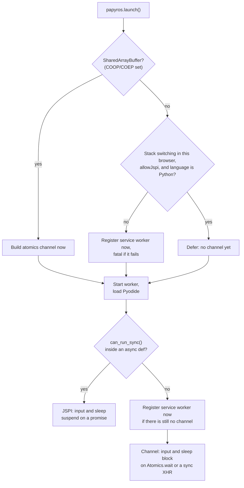

# Papyros

<p align="center">
  <a href="https://www.npmjs.com/package/@dodona/papyros">
    
  </a>
  <a href="https://github.com/dodona-edu/papyros/actions?query=branch%3Amain">
    
  </a>
  <a href="https://github.com/dodona-edu/papyros/blob/main/LICENSE">
    
  </a>
</p>

Papyros is a programming scratchpad in the browser. It allows running code directly in your browser, no installation required. 
Right now, the focus is on providing a great experience for Python, while also supporting JavaScript.
By taking away obstacles between students and coding, the learning experience becomes smoother and less error-prone.

Currently, Papyros provides support for the following programming languages:
- Python, powered by [Pyodide](https://pyodide.org/en/stable/)
- JavaScript, powered by your browser

---

## Try it Online

Start coding directly in your [browser](https://papyros.dodona.be/).

---

## Use papyros in your project

### Installation

Install via npm or yarn:

```shell
npm install @dodona/papyros
# or
yarn add @dodona/papyros
```

### Setup input handling

`input()` and `time.sleep()` have to block a worker until the main thread answers, which a
worker cannot normally do. Papyros has three ways to achieve it and picks one per backend.

#### JSPI (no setup needed)

Where the browser supports WebAssembly stack switching, Pyodide suspends the wasm stack and
resumes when a promise settles. Nothing to configure, and no channel is involved. Chrome 137+,
Firefox 153+ and Safari 27+ take this path, so the channels below are for older browsers. It
applies to Python only: the JavaScript backend runs user code with no wasm on the stack, so
nothing can suspend it, and it always uses a channel.

Set `papyros.runner.allowJspi = false` to force one of the channels below, for instance to
work around a browser whose stack switching misbehaves.

#### COOP/COEP headers
Add the following HTTP headers to your server responses:

```yaml
{
  "Cross-Origin-Opener-Policy": "same-origin",
  "Cross-Origin-Embedder-Policy": "require-corp"
}
```
These headers are required to enable `SharedArrayBuffer`, which is the preferred way to handle synchronous input.
They need to be set on all assets that are loaded, including scripts, images, fonts, etc.

#### Service Worker
If you cannot set these headers, you can use a service worker to handle input.
We provide a compiled and minified version of the `InputServiceWorker` in the `dist` folder.
You need to serve this file from the root of your domain (i.e. `/input-sw.js`).
You can then register the service worker in your application before launching: `papyros.serviceWorkerName = 'input-sw.js';`.

Registration is lazy. Papyros only registers the service worker once a backend turns out to
need the channel, so a Python scratchpad on a browser with JSPI never registers one at all.

#### How a backend picks its transport



"Stack switching in this browser" is `WebAssembly.Suspending` or the older
`WebAssembly.Suspender`, matching how Pyodide itself detects it. That test is only a hint,
so getting it wrong costs at most one service worker nobody uses: the probe inside the worker
is what actually selects the transport.

The probe runs after Pyodide has loaded, which is why the decision cannot be made up front. The
main thread can see that the browser has the feature, but not that the Pyodide build being
served and the calling convention used will actually suspend. `run_sync` is
[documented as experimental](https://pyodide.org/en/stable/usage/api/python-api/ffi.html), and
`can_run_sync()` is the supported way to ask, so Papyros asks rather than assumes. Deferring
registration is what lets the answer arrive late without having registered a service worker
just in case.

If a backend needs the channel and it cannot be created, the error is passed to
`papyros.errorHandler` and the channel stays null. Code still runs; only reading input fails.

Interrupting is a separate axis. A program waiting on input or sleeping is always interrupted
cheaply, whichever transport it uses. A program in a busy loop needs Pyodide's interrupt buffer,
which needs `SharedArrayBuffer`; without one, stopping it replaces the worker and reloads the
interpreter. JSPI does not change that.

---

## Usage

### Minimal setup

If you only want to use the state and runner logic without UI components:

```ts
import { papyros } from "@dodona/papyros";

papyros.launch(); // heavy operation, loads workers and Pyodide
papyros.runner.code = "print(input())";

papyros.io.subscribe(
  () => (papyros.io.awaitingInput ? papyros.io.provideInput("foo") : ""),
  "awaitingInput"
);

await papyros.runner.start();
console.log(papyros.runner.io.output[0].content);
```

### Minimal setup with components

Papyros provides four web components for visualization.
Each expects a `papyros` state instance, but defaults to the global `papyros`.

```html
<script type="module">
  import { papyros } from "@dodona/papyros";

  papyros.launch();
</script>

<p-code-runner></p-code-runner>
<p-debugger></p-debugger>
<p-input></p-input>
<p-output></p-output>
```

### Multiple instances

The global `papyros` is just a default instance. Every `new Papyros()` owns its own event
bus, backend workers and input channel, so several instances can run code on the same page
at the same time, even in the same language. The one service worker registration a page can
have is shared between them. Call `papyros.dispose()` to terminate an instance's workers
when it is removed from the page.

---

## Theming

Papyros uses [Material Web Components](https://github.com/material-components/material-web) for buttons, inputs, sliders, etc.
All styling is driven by Material color system CSS variables (`--md-sys-color-...`).
Generate your own theme using the [Material Theme Builder](https://material-foundation.github.io/material-theme-builder/).

* Three example themes (light + dark) are provided via `papyros.constants.themes`.
* A theme picker component is available out of the box.

---

## Structure

The codebase organized into clear layers:

* `backend`: code execution functionality (runs in Web Workers)
* `communication`: helpers to connect frontend and backend
* `frontend`: all browser-side code
    * `state`: state management (e.g. execution state, debugger, input/output)
    * `components`: visualization of that state, as Lit web components
* `sync`: synchronous communication between the main thread and the workers, so that Python
  `input()` and `time.sleep()` can block a worker until the main thread answers

### Components

#### `<p-code-runner>`

A [CodeMirror 6](https://codemirror.net/6/) editor to edit, run, and debug code.
Additional buttons can be added via the `.buttons` slot.
Reflects a `backend-ready` attribute once the backend has finished loading, so surrounding pages can style or wait on it.

#### `<p-input>`

Lets users provide input (batch or interactive), passed to `papyros.io`.

#### `<p-output>`

Visualizes program output: stdout, stderr, and images.

#### `<p-debugger>`

Displays execution traces using [`@dodona/json-tracer`](https://github.com/dodona-edu/json-tracer).

### State API

A `Papyros` instance contains multiple logical parts:

* `papyros.constants`: general settings, constants, and themes (can be overridden).
* `papyros.debugger`: debug frames and currently active frame.
* `papyros.events`: the event bus delivering backend events (output, errors, frames, ...) to this instance's state.
* `papyros.examples`: available code examples.
* `papyros.i18n`: translations (extend or override as needed).
* `papyros.io`: input/output handling. Subscribe to `awaitingInput` to supply input when needed.
* `papyros.runner`: code, execution state, programming language. Run code with `papyros.runner.start()`.
  Subscribe to `backendReady` to know when the backend has loaded; runs started before that are queued.
* `papyros.test`: test code (appended to the code document).

---

## Development

```shell
# Clone the repository:
git clone git@github.com:dodona-edu/papyros.git
cd papyros
# Install dependencies:
yarn install
# Build the python packages:
yarn setup
# Start a local server with live reload:
yarn start
```

## Publishing

```shell
# Build as library
yarn build:lib
# Publish to npm
yarn publish
```

## Third-party code

`src/sync/` and `src/backend/workers/python/pyodide_worker_runner.py` are vendored from
[sync-message](https://github.com/alexmojaki/sync-message),
[comsync](https://github.com/alexmojaki/comsync) and
[pyodide-worker-runner](https://github.com/alexmojaki/pyodide-worker-runner),
all MIT licensed and copyright (c) 2022 Alex Hall. See [THIRD-PARTY-NOTICES.md](THIRD-PARTY-NOTICES.md).
